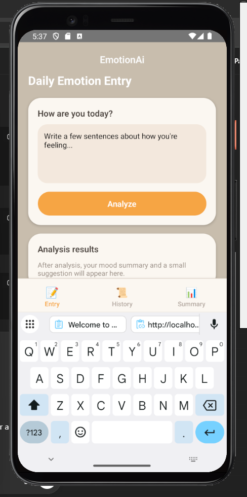
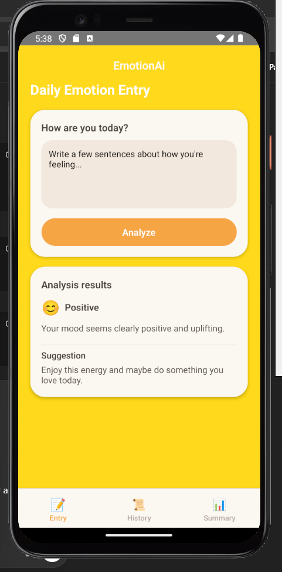
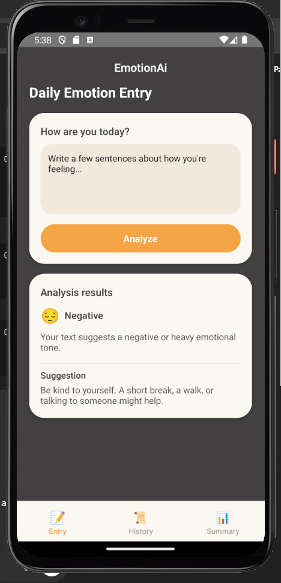
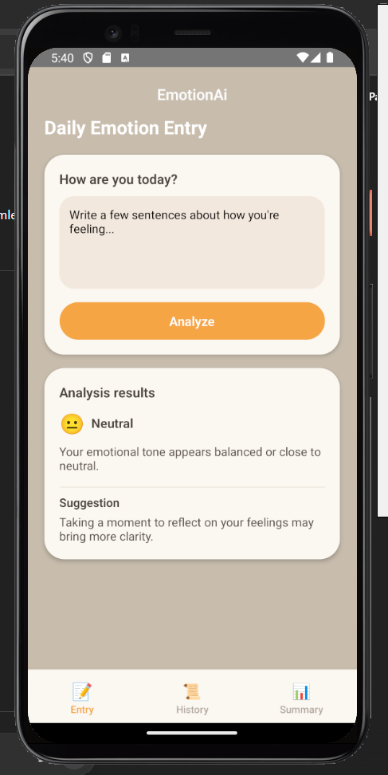
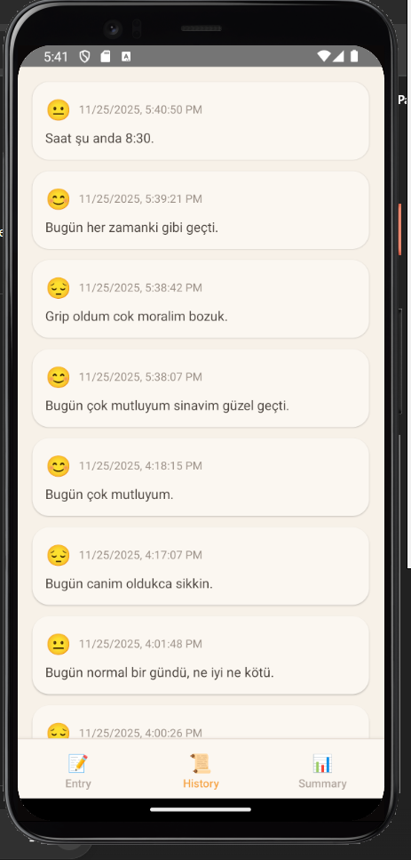

# EmotionAI – Duygu Analizi Günlük Uygulaması

EmotionAI, kullanıcının günlük metin girişlerinden duygu durumunu analiz eden, geçmiş kayıtları saklayan ve haftalık özet çıkarabilen bir React Native mobil uygulamasıdır.

---

## Özellikler

### Metin Analizi (Sentiment Analysis)
- Kullanıcı bir cümle veya günlük yazısı girer.
- Uygulama, yazının duygu tonunu **Pozitif / Negatif / Nötr** olarak sınıflandırır.
- Renkli geri bildirim göstergeleriyle kullanıcıya görsel sonuç sunulur.

### Günlük Kayıt Ekleme
- Kullanıcı analiz edilmiş metni kaydedebilir.
- Tüm kayıtlar **lokalde** saklanır (AsyncStorage).
- İnternet olmasa bile geçmiş analizler görüntülenebilir.

### Geçmiş (History) Sayfası
- Kullanıcının tüm kayıtlarını tarih sırasıyla gösterir.
- Renk kodlu duygularla birlikte listelenir.

### Haftalık Özet (Weekly Summary)
- Kullanıcının son 7 güne ait duygu yüzdelerini hesaplar.
- Pozitif – Negatif – Nötr oranlarını grafiksel olarak sunar.
- İnternet gerekmez, tamamen yerel verilerden hesaplanır.

### Modern ve Basit Arayüz
- Güncel React Native UI prensipleriyle minimal tasarım.
- Alt menü (Tab Navigation):
  - **Entry**
  - **History**
  - **Weekly Summary**

### Lokal Veri Saklama (Offline Support)
- Tüm kayıtlar cihazın lokal deposunda saklanır.
- İnternetsiz kullanımda bile tüm tarihçeler ve özetler çalışır.

### Splash Screen & Logo
- Uygulama açılışında özel logo ve splash ekranı gösterilir.
- react-native-bootsplash ile optimize edilmiş hızlı açılış.

---

## Uygulama Ekranları

| Ekran | Açıklama |
|------|----------|
|  | Kullanıcının günlük duygu metnini girdiği, analiz yapılmamış varsayılan giriş ekranı. |
|  | Analiz sonucunun pozitif olduğu durumda, parlak arka plan ve metinle gösterilen geri bildirim ekranı. |
|  | Metnin olumsuz veya ağır bir duygu taşıması durumunda gösterilen, koyu temalı geri bildirim ekranı. |
|  | Duygu tonunun nötre yakın olduğu, dengeli bir ruh halinin gösterildiği analiz sonucu ekranı. |
|  | Kullanıcının önceki tüm girişlerini tarih ve duygu etiketiyle listeleyen geçmiş ekranı. |
|  | Son 7 güne ait pozitif, nötr ve negatif duygu oranlarını yüzdesel ve sayısal olarak gösteren haftalık özet ekranı. |

---

## Kullanılan Teknolojiler

| Alan | Teknoloji |
|------|-----------|
| Mobil Framework | **React Native 0.82** |
| Navigasyon | @react-navigation/native |
| Durum Yönetimi | Context API + useReducer |
| Depolama | AsyncStorage |
| Arayüz | React Native Components |
| Splash | react-native-bootsplash |
| Duygu Analizi | HuggingFace ücretsiz sentiment modeli | Bakınız: https://huggingface.co/tabularisai/multilingual-sentiment-analysis |

---

## Proje Yapısı

```
EmotionAi/
│── App.js
│── src/
│   ├── screens/
│   │   ├── DailyEntryScreen.js
│   │   ├── HistoryScreen.js
│   │   └── WeeklySummaryScreen.js
│   ├── context/
│   │   └── MoodContext.js
│   ├── services/
│   │   └── aiService.js
│── android/
│── ios/
│── assets/
```

---

## Çalıştırma

### 1. Gerekli paketleri yükle
```
npm install
```

### 2. Metro başlat
```
npx react-native start
```

### 3. Android çalıştır
```
npx react-native run-android
```

---

## Notlar
- Tüm analiz sonuçları cihazda saklandığı için kullanıcı verisi hiçbir yere gönderilmez.
- Uygulama offline durumda da tamamen çalışabilir.
- Hafif, modern ve pratik bir günlük & duygu takip çözümüdür.

---

## Geliştiren
**Sevgi Nur Öksüz**
